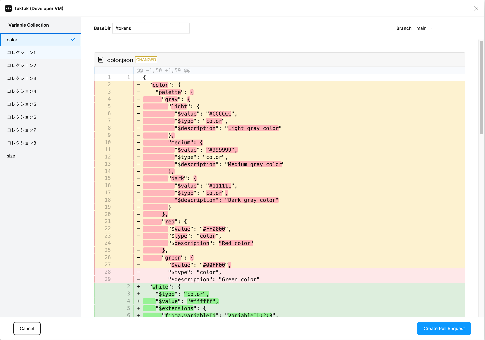

## Authentication

Follow the steps below to authenticate with Figma.

- [GitHub](../github/authentication.md)

## Review Changes

1. Select the repository you want to work on.
2. Review your changes. If you want to change file dir (in github repos) or branch, set the `BaseDir` and `Branch` parameters.

## Create Pull Request

1. If your changes are ready, click the `Create Pull Request` button.
2. Input the `Branch Nane` and `Title` of the pull request. If the branch on the previous screen is a protected branch, you need to change the branch name.
3. Click the `Create Pull Request` button.

## Next Steps

1. If you completed to create a pull request, you can see the pull request page.
2. Share the pull request page with developers and get feedback.
