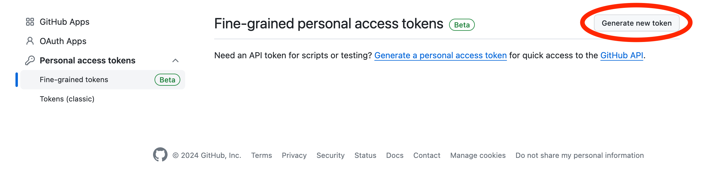

## Create Personal Access Token

Go to [GitHub Personal Access Token](https://github.com/settings/tokens?type=beta) page and click `Generate new token` button.
Fine-grained permissions is recommended to use. But, Classic permissions is also available.

### Fine-grained token permissions (recommended)

Future support for fine-grained permissions is planned.

<!-- Input the following and click the `Generate token` button.

- `Token name` .. Specify any unique name.
- `Expiration` .. Specify any expiration date. It is recommended not to be too long.
- `Resource owner` .. Select the user who owns the target repository.
- `Repository access` .. It is okay to select any repository, but it is recommended to select `Only select repositories` and set the target repository to a minimum.
- `Permissions` .. In `Repository permission`, Setting the following permissions is recommended. Do not set `User permission` `Organization permission`.
  - `Contents` .. `Read and write`
  - `Pull requests` .. `Read and write`
  - `Metadata` .. `Read only` (default) -->

### Classic token permissions

Input the following and click the `Generate token` button.

- `Expiration` .. Specify any expiration date. It is recommended not to be too long.
- `Select scopes` .. Select the following scopes.
  - `repo` .. required to list repository, get contents, push commits, and create pull requests.
  - `read:org` .. required to list organization repository.
